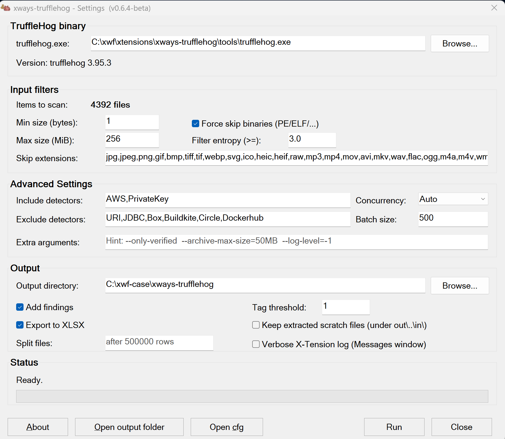

# xways-trufflehog

> X-Ways Forensics X-Tension that wraps [trufflesecurity/trufflehog](https://github.com/trufflesecurity/trufflehog) v3.x. Scan items in a volume snapshot (or a right-click selection) for Trugglehog's built-in secret patterns plus your own custom YAML detectors, with results dropped into per-detector Report Tables and a consolidated XLSX.



## What it does

- Iterates the active view (or a right-click selection) and feeds each item's to `trufflehog filesystem --json`.
- Batches per chunk (default 100 items per `trufflehog.exe` launch) to amortise Go startup cost — orders of magnitude faster than per-item invocation.
- Dedups by stored hash (`XWF_GetHashValue`) so identical copies across user profiles / VSCs / system-restore points scan once.
- Tags hits into per-detector Report Tables (`trufflehog: AWS`, `trufflehog: Slack`, `trufflehog: custom:<your_pattern>` …) and writes a per-evidence `*-trufflehog.xlsx` with one row per finding.
- Pre-extract filters (min/max size, extension skip list) drop obvious non-text before bytes touch disk.

## Forensic-workstation safety (defaults)

- **Verification is OFF by default.** The X-Tension always passes `--no-verification` to TruffleHog, so a default run makes **zero outbound network calls** — built-in detectors that *can* verify won't phone home.
- To opt INTO live verification, add `--only-verified` to the dialog's **Extra arguments** field. This is explicitly opt in for this X-Tension.
- `--no-update` is always passed.
- The X-Tension reads via `XWF_Read` (in-snapshot) and never modifies evidence. Output files (jsonl, xlsx) are derivatives written to the case dir.

## Requirements

- Windows 10 / 11 / Server 2016+, x64.
- X-Ways Forensics **21.7+**
- `trufflehog.exe` v3.x for Windows — grab a release from <https://github.com/trufflesecurity/trufflehog/releases>. Not bundled here.

## Install

Three pieces, three sources:

- **`xways-trufflehog.dll`** — this repo. Download from the [Releases](https://github.com/kev365/xways-trufflehog/releases) page.
- **`trufflehog.exe`** — upstream. Download a Windows release from <https://github.com/trufflesecurity/trufflehog/releases>. Not shipped here.
- **`xways-trufflehog.cfg`** — optional analyst-tunable defaults. Ships as `.cfg.example`; the X-Tension copies it to `xways-trufflehog.cfg` on first run if none exists.

Drop the bundle into your X-Ways install:

```text
<X-Ways install>\
├── xwforensics64.exe                 (or xwb64.exe for BYOD)
└── xtensions\
    └── xways-trufflehog\
        ├── xways-trufflehog.dll
        ├── xways-trufflehog.cfg      (saves settings)
        ├── hog.ico
        └── tools\
            └── trufflehog\
                └── trufflehog.exe    (auto-resolved when in this path)
```

The `tools\trufflehog\` path is **relative to the DLL folder**, not the X-Ways install root. You can also point at `trufflehog.exe` anywhere on disk via the dialog's **Browse...** button.

## Run

Tools → Run X-Tensions... → **+** → pick `xways-trufflehog.dll` → tune the dialog → click **Run**. Right-click a Directory-Browser selection and pick the same menu to scan just the selected items.

**First-run sanity check**: confirm the dialog's `Version:` line reads `trufflehog 3.x.x` (not bold red) before clicking Run — that means the helper-exe identity probe accepted the binary.

**Ctrl+Run** saves the current dialog state to the sidecar cfg without launching a scan. **Ctrl+Close** opens a Save-as picker to export the current settings to a chosen path.

## Custom detectors (encouraged)

TruffleHog accepts a YAML pattern pack via `--config=<file>`, applied on top of its ~800 built-ins. The X-Tension exposes this as the optional cfg key `custom_config_path`:

```ini
custom_config_path=C:\xways\xtensions\xways-trufflehog\custom-detectors\mypatterns.yml
```

Schema and worked examples: <https://docs.trufflesecurity.com/custom-detectors>. The X-Tension also extracts per-pattern names from the `ExtraData.name` field, so custom hits land in granular `trufflehog: custom:<name>` report tables instead of one giant `CustomRegex` bucket.

**Have a pattern that's useful in forensic cases? Send it in.** PRs welcome under [`custom-detectors/contributed/`](custom-detectors/) — one YAML file per contribution, attribution preserved via a `# author:` comment, see [`custom-detectors/README.md`](custom-detectors/README.md).

## Licensing & attribution

- **xways-trufflehog** (this repo, wrapper code) is MIT-licensed — see [LICENSE](LICENSE).
- See **TruffleHog** license here: [trufflesecurity/trufflehog](https://github.com/trufflesecurity/trufflehog/blob/main/LICENSE) (AGPL-3.0).

## Disclaimer

Community-developed X-Tension. Not affiliated with, endorsed by, or supported by X-Ways AG or Truffle Security Co. Vibe-coded — use at your own risk. If you find issues or have recommendations, please submit!

## Author

Kevin Stokes — [LinkedIn](https://www.linkedin.com/in/dfir-kev) · [Buy me a coffee](https://buymeacoffee.com/dfirkev)
